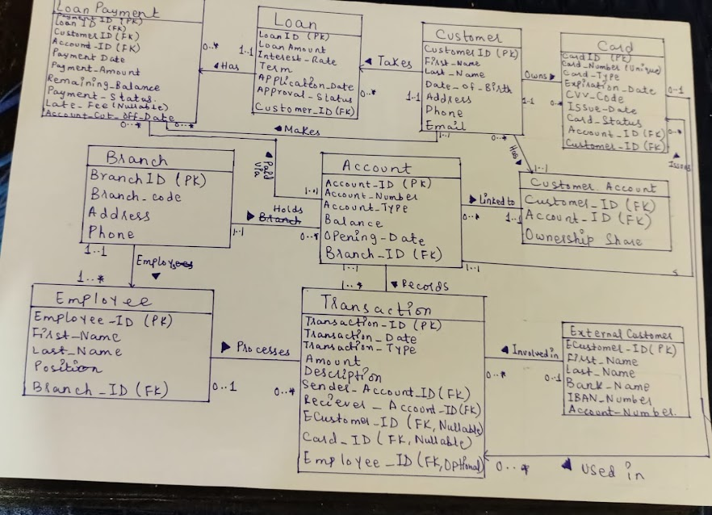
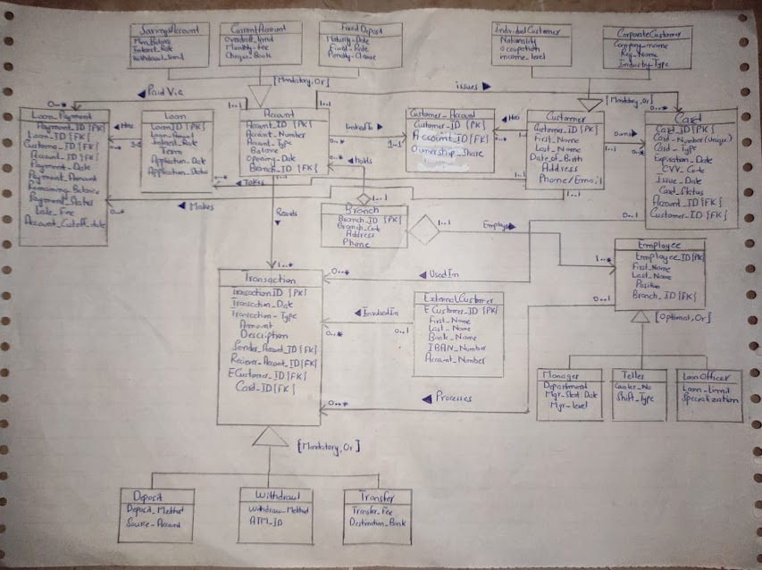

# 🏦 Banking Database Management System

<div align="center">


**A fully normalized relational database system for a real-world Banking application**  
*CT-261 Database Management Systems — CSIT Batch 2024, Spring 2026*  
*NED University of Engineering & Technology — Department of Computer Science & IT*

</div>

---

## 📋 Table of Contents

- [Project Overview](#-project-overview)
- [Project Structure](#-project-structure)
- [Database Design](#-database-design)
- [ERD Diagram](#-erd-diagram)
- [EERD Diagram](#-eerd-diagram)
- [Schema — All Tables](#-schema--all-tables)
- [EER Concepts Applied](#-eer-concepts-applied)
- [Normalization Summary](#-normalization-summary)
- [Sample Queries](#-sample-queries)
- [How to Run](#-how-to-run)
- [Known Limitations & Future Work](#-known-limitations--future-work)
- [Project Report](#-project-report)
---

## 🎯 Project Overview
This project presents a complete, end-to-end Banking Database Management System designed from scratch using formal database design methodology as part of the Database Management Systems (DBMS) course.

The system was developed following a structured database lifecycle approach, including:

- ✅ Conceptual design (ERD)
- ✅ Enhanced conceptual design (EERD) with specialization, generalization, and aggregation
- ✅ Functional dependency analysis (21 FDs)
- ✅ Full normalization from UNF → 1NF → 2NF → 3NF → **BCNF**
- ✅ Physical implementation in **MySQL 8.0**
- ✅ Execution of 10+ SQL queries (JOINs, aggregations, and subqueries) for data retrieval and analysis

---


## 📁 Project Structure

```
Banking-DBMS/
│
├── diagrams/
│   ├── EERD.jpeg              # Enhanced ER Diagram (EERD)
│   └── ERD.jpeg               #  Entity-Relationship Diagram (ERD)
│
├── database/
│   ├── schema.sql                          # DDL — all 21 CREATE TABLE statements
│   ├── sample_data.sql                     # INSERT statements with sample records
│   ├── sample_queries.sql                  # Core SQL queries (JOINs, aggregations)
│   └── banking_sql_practice_queries.html   # Additional practice queries (HTML format)
│
├── docs/
│   ├── Screenshots/                        # Screenshots of query outputs 
│   └── Banking_DBMS_Report_FINAL.pdf       # Full academic project report
│
├── .gitattributes
└── README.md
```

---

## 🗄️ Database Design

### Business Requirements

The Banking DBMS handles the following real-world features:

| Feature | Description |
|---------|-------------|
| 🏧 **Multi-type Accounts** | Savings (minimum balance, interest rate), Current (overdraft limit, cheque book), Fixed Deposit (maturity date, penalty clause) |
| 👤 **Dual Customer Types** | Individual (NIC, nationality, income level) and Corporate (company registration, industry type) |
| 🔗 **Joint Account Ownership** | M:N relationship resolved via `Customer_Account` junction table with configurable ownership share |
| 💸 **Transaction Lifecycle** | Deposit, Withdrawal, and Transfer (including inter-bank transfers via IBAN) |
| 💳 **Card Management** | Debit/Credit cards with CVV, expiry date, issue date, and card status tracking |
| 🏦 **Loan Management** | Application → Approval → EMI schedule → Remaining balance → Audit trail |
| 👨‍💼 **Employee Roles** | Manager, Teller, Loan Officer — each with role-specific attributes via specialization |
| 🌍 **External Customers** | Inter-bank wire transfers with IBAN validation |

---

## 📊 ERD Diagram

> The Entity-Relationship Diagram represents the **conceptual model** of the Banking DBMS, showing all entities, attributes, and relationships.



### Key Relationships

| Relationship | Entities | Cardinality |
|---|---|---|
| Takes | Customer → Loan | 1 to 0..* |
| Has | Loan → Loan_Payment | 1 to 0..* |
| Holds | Branch → Account | 1 to 0..* |
| Employs | Branch → Employee | 1 to 1..* |
| Linked To | Customer ↔ Account | M:N via Customer_Account |
| Records | Account → Transaction | 1 to 0..* |
| Processes | Employee → Transaction | 0..1 to 0..* |
| Used In | Card → Transaction | 0..1 to 0..* |
| Involved In | External_Customer → Transaction | 0..1 to 0..* |
| Issues | Account → Card | 1 to 0..* |
| Owns | Customer → Card | 1 to 0..* |
| Paid Via | Account → Loan_Payment | 1 to 0..* |

---

## 📐 EERD Diagram

> The Enhanced Entity-Relationship Diagram extends the ERD with **specialization/generalization hierarchies** and **aggregation**.



---

## 📂 Schema — All Tables

The database contains **21 fully normalized tables**, all achieving **BCNF**:

### Core Entities (Strong)

| Table | Primary Key | Description |
|-------|-------------|-------------|
| `Branch` | Branch_ID | Bank branches |
| `Customer` | Customer_ID | Base customer entity (superclass) |
| `Account` | Account_ID | Base account entity (superclass) |
| `Employee` | Employee_ID | Base employee entity (superclass) |
| `Loan` | Loan_ID | Loan applications and approvals |
| `Card` | Card_ID | Debit/Credit cards |
| `Transaction` | Transaction_ID | All financial transactions (superclass) |
| `External_Customer` | ECustomer_ID | Inter-bank transfer recipients |

### Weak Entity

| Table | Partial Key | Owner | Description |
|-------|-------------|-------|-------------|
| `Loan_Payment` | Payment_ID | Loan | Individual loan repayment records |

### Junction Entity

| Table | Composite PK | Description |
|-------|-------------|-------------|
| `Customer_Account` | (Customer_ID, Account_ID) | Resolves M:N — supports joint accounts |

### EER Subclass Tables

| Superclass | Subclass Tables | Constraint |
|---|---|---|
| `Account` | `Savings_Account`, `Current_Account`, `Fixed_Deposit` | {Mandatory, Or} |
| `Customer` | `Individual_Customer`, `Corporate_Customer` | {Mandatory, Or} |
| `Employee` | `Manager`, `Teller`, `Loan_Officer` | {Optional, Or} |
| `Transaction` | `Deposit`, `Withdrawal`, `Transfer` | {Mandatory, Or} |

---

## 🔷 EER Concepts Applied

### 1. Specialization / Generalization

Four inheritance hierarchies were identified:

```
Account {Mandatory, Or}
├── Savings_Account   → Min_Balance, Interest_Rate, Withdrawal_Limit
├── Current_Account   → Overdraft_Limit, Monthly_Fee, Cheque_Book
└── Fixed_Deposit     → Maturity_Date, Fixed_Rate, Penalty_Clause

Customer {Mandatory, Or}
├── Individual_Customer → Nationality, NIC, Income_Level
└── Corporate_Customer  → Company_Name, Reg_Number, Industry_Type

Employee {Optional, Or}
├── Manager      → Department, Mgr_Start_Date, Mgr_Level
├── Teller       → Counter_No, Shift_Type
└── Loan_Officer → Loan_Limit, Specialization

Transaction {Mandatory, Or}
├── Deposit    → Deposit_Method, Source_Account
├── Withdrawal → Withdraw_Method, ATM_ID
└── Transfer   → Transfer_Fee, Destination_Bank
```

### 2. Aggregation

The **Branch** entity acts as the "whole" in two aggregation relationships:
- `Branch ◇── Holds ──▶ Account` — Branch is a composite of its Accounts
- `Branch ◇── Employs ──▶ Employee` — Branch is a composite of its Employees

### 3. Entity Type Summary

| Type | Count | Entities |
|---|---|---|
| Strong Entities | 8 | Branch, Customer, Account, Loan, Card, Employee, Transaction, External_Customer |
| Weak Entity | 1 | Loan_Payment |
| Junction Entity | 1 | Customer_Account |
| EER Subclasses | 11 | All specialization subclass tables |

---

## 📐 Normalization Summary

All 21 tables were normalized from **Unnormalized Form (UNF)** through to **BCNF**.

### Problems Found & Fixed

| Table | UNF Problem | Fix Applied | Final Form |
|-------|------------|-------------|------------|
| Customer | Repeating phone groups, mixed individual/corporate attributes | Split into 3 tables | **BCNF** |
| Loan | Repeating payment groups, redundant customer/branch data | Extracted `Loan_Payment` table, used FKs | **BCNF** |
| Account | Repeating owner groups, type-specific mixed columns | Junction table + subclass tables | **BCNF** |
| Employee | NULL-heavy role-specific columns, redundant branch data | Subclass tables per role | **BCNF** |
| Transaction | Derived balances stored, full card details copied, type-mixed columns | FKs only + subclass tables | **BCNF** |

### Functional Dependencies (Key Examples)

```
Branch_ID          → Branch_Code, Address, Phone
Customer_ID        → First_Name, Last_Name, Date_of_Birth, Address, Phone, Email
Account_ID         → Account_Number, Account_Type, Balance, Opening_Date, Branch_ID
(Customer_ID,
 Account_ID)       → Ownership_Share
Employee_ID        → First_Name, Last_Name, Position, Branch_ID
Transaction_ID     → Transaction_Date, Transaction_Type, Amount, Description
Loan_ID            → Loan_Amount, Interest_Rate, Term, Application_Date, Approval_Status
```

> 📄 Full list of all 21 Functional Dependencies is available in the [project report](docs/)

---

## 💻 Sample Queries

### Query 1 — Customer Accounts with Balance (JOIN)
```sql
SELECT c.Customer_ID,
       CONCAT(c.First_Name, ' ', c.Last_Name) AS Full_Name,
       a.Account_Number,
       a.Account_Type,
       a.Balance
FROM Customer c
JOIN Customer_Account ca ON c.Customer_ID = ca.Customer_ID
JOIN Account a            ON ca.Account_ID  = a.Account_ID
ORDER BY a.Balance DESC;
```

### Query 2 — Total Accounts Per Branch (GROUP BY + COUNT)
```sql
SELECT b.Branch_Code,
       b.Address,
       COUNT(a.Account_ID) AS Total_Accounts
FROM Branch b
LEFT JOIN Account a ON b.Branch_ID = a.Branch_ID
GROUP BY b.Branch_ID, b.Branch_Code, b.Address
ORDER BY Total_Accounts DESC;
```

### Query 3 — Loan Repayment Summary (Multi-table JOIN)
```sql
SELECT lp.Payment_ID,
       CONCAT(c.First_Name, ' ', c.Last_Name) AS Customer_Name,
       l.Loan_Amount,
       lp.Payment_Amount,
       lp.Remaining_Balance,
       lp.Payment_Status,
       a.Account_Number AS Paid_From
FROM Loan_Payment lp
JOIN Customer c ON lp.Customer_ID = c.Customer_ID
JOIN Loan l     ON lp.Loan_ID     = l.Loan_ID
JOIN Account a  ON lp.Account_ID  = a.Account_ID
ORDER BY lp.Payment_Date;
```

### Query 4 — Total Deposits and Withdrawals Per Account (CASE + SUM)
```sql
SELECT a.Account_Number,
       SUM(CASE WHEN t.Transaction_Type = 'Deposit'
           THEN t.Amount ELSE 0 END)    AS Total_Deposits,
       SUM(CASE WHEN t.Transaction_Type = 'Withdrawal'
           THEN t.Amount ELSE 0 END)    AS Total_Withdrawals,
       COUNT(t.Transaction_ID)          AS Total_Transactions
FROM Account a
LEFT JOIN Transaction t
       ON a.Account_ID = t.Sender_Account_ID
       OR a.Account_ID = t.Receiver_Account_ID
GROUP BY a.Account_ID, a.Account_Number
ORDER BY Total_Transactions DESC;
```

> 📄 All queries with full explanations are in [`database/sample_queries.sql`](database/sample_queries.sql)

---

## ▶️ How to Run

### Prerequisites
- MySQL 8.0+ installed
- MySQL Workbench (optional but recommended)

### Steps

```bash
# 1. Clone the repository
git clone https://github.com/HuzaifaJawed77/Banking-DBMS.git
cd Banking-DBMS

# 2. Log in to MySQL
mysql -u root -p

# 3. Create the database
CREATE DATABASE BankingManagementSystem;
EXIT;

# 4. Run the schema (creates all 21 tables)
mysql -u root -p BankingManagementSystem < database/schema.sql

# 5. Insert sample data
mysql -u root -p BankingManagementSystem < database/sample_data.sql

# 6. Run the queries
mysql -u root -p BankingManagementSystem < database/sample_queries.sql
```

### Or run manually in MySQL Workbench:
1. Open **MySQL Workbench** and connect to your local MySQL server
2. Create a new schema named `BankingManagementSystem`
3. Open and execute `database/schema.sql`
4. Open and execute `database/sample_data.sql`
5. Open and execute `database/sample_queries.sql`

---

## ⚠️ Known Limitations & Future Work

- **No stored procedures or triggers** — business logic is currently handled at the query level
- **No role-based access control** — all queries run under a single MySQL user
- **Static sample data** — the dataset is small and intended for demonstration purposes only
- **No transaction rollback handling** — partial failures in multi-step transfers are not yet covered
- **Future improvements:** implement views for common reports, define an indexing strategy, and integrate with a front-end interface

---

## 📄 Project Report

The full academic report is available in the [`docs/`](docs/) folder.

### Report Contents
- ✅ Problem Statement & Business Requirements
- ✅ Limitations of Current Systems
- ✅ ERD with entity-relationship descriptions
- ✅ EERD with specialization/generalization & aggregation
- ✅ 21 Functional Dependencies
- ✅ Full Normalization (UNF → 1NF → 2NF → 3NF → BCNF) for 5 tables
- ✅ Complete DDL Schema
- ✅ INSERT, UPDATE, DELETE, SELECT queries


---

## 📊 Project Stats

```
Total Tables           : 21
Strong Entities        : 8
Weak Entity            : 1
Junction Tables        : 1
EER Subclasses         : 11
Functional Dependencies: 21
Normal Form Achieved   : BCNF
Sample Queries         : 10+
Course Grade           : 9/10
```

---

## 📜 License

This project was submitted as an academic deliverable for **CT-261 Database Management Systems** at NED University of Engineering & Technology. It is intended for educational purposes only.

---

<div align="center">

**CT-261 Database Management Systems**  
Department of Computer Science & IT — NED University of Engineering & Technology  
CSIT Batch 2024 | Spring 2026

*Made with 💙 and a lot of normalization*

</div>
